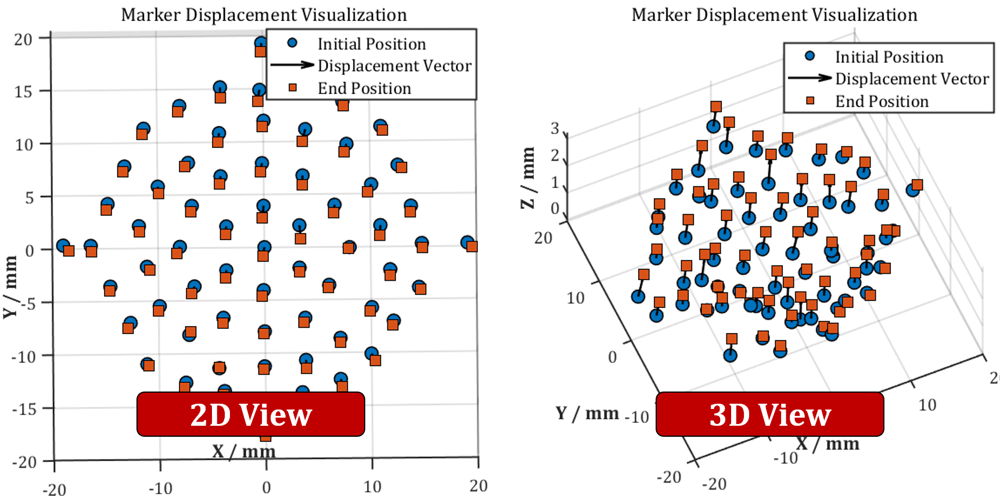
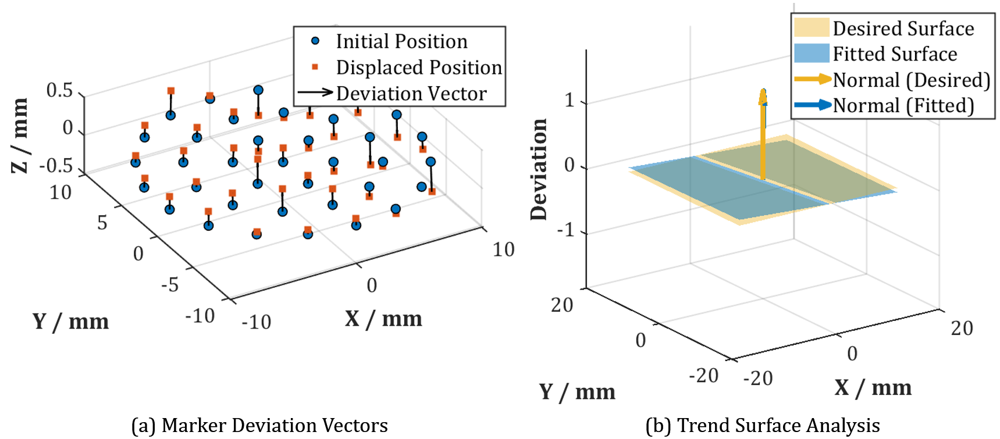
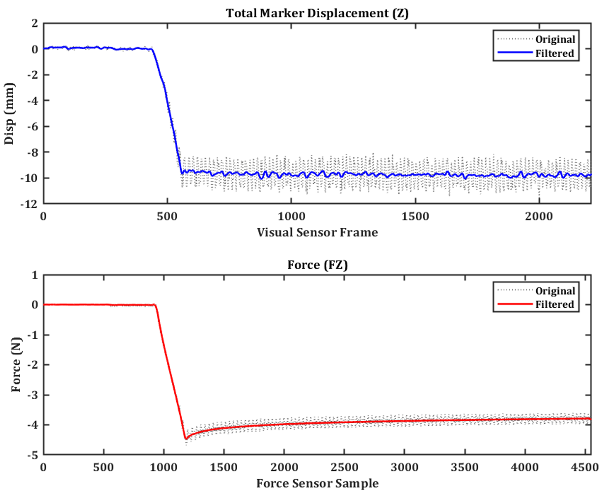
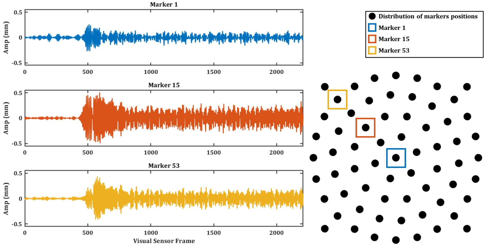

# A Novel Bonnet Polishing Approach with a Vision-Based Sensor for In-Situ Characterization of Contact Force and Pose Misalignment

Created by Feiyu Zhang, Jieji Ren, Langlang Yuan, Mengqi Rao, Yuehong Yin

## Introduction

This work is based on our CIRP 2026 paper titled _**A Novel Bonnet Polishing Approach with a Vision-Based Sensor for In-Situ Characterization of Contact Force and Pose Misalignment**_. We propose an embedded vision-based sensor utilizing inner-surface marker tracking to achieve in-situ perception of the contact state. This approach realizes precise pose error compensation and significant surface quality optimization.

## 1. Hardware System Prototype

To validate the in-situ characterization methodology proposed in the paper, a vision-based sensor was developed and integrated into a self-developed 5-axis robot arm.

  
   
  <b>Figure 1: Overall Hardware System Architecture.</b>

  
   
  <b>Figure 2: Physical Implementation Details.</b>

## 2. Algorithm Verification

The proposed approach converts raw visual signals into quantitative contact state information via four sequential stages. Below, we detail the implementation and validation results for each stage.

### A. 2D Feature Extraction (Sub-pixel Capture)
The raw image captured by the internal camera is processed to extract marker centroids and IDs. The specific implementation is available in the [`Marker_Tracking`](./code/Marker_Tracking) directory. Figure 3 illustrates the dynamic 2D feature extraction process and the recognized 2D marker array from a static frame.

  <table>
    <tr>
      <td align="center">
        
         
        <b>Figure 3 (a): Dynamic 2D Feature Extraction.</b>
      </td>
      <td align="center">
        
         
        <b>Figure 3 (b): 2D Recognition (Static Frame).</b>
      </td>
    </tr>
  </table>

### B. 3D Displacement Field Reconstruction
Based on the 2D feature changes, the 3D displacement vectors are reconstructed using geometric constraints. The complete reconstruction pipeline is provided in the [`Marker_Calibration`](./code/Marker_Calibration) directory:

*   **Intrinsic Matrix Fitting:** [`intrinsic_calibration.py`](./code/Marker_Calibration/intrinsic_calibration.py) for camera parameter estimation (Figure 4 (a)).
*   **Extrinsic Matrix Fitting:** [`extrinsic_calibration.py`](./code/Marker_Calibration/extrinsic_calibration.py) for coordinate system alignment (Figure 4 (b)).
*   **3D Reconstruction:** [`3d_reconstruction.py`](./code/Marker_Calibration/3d_reconstruction.py) for resolving the spatial displacement field (Figure 4 (c)).

  <table>
    <tr>
      <td align="center">
        
         
        <b>Figure 4 (a): Intrinsic Calibration.</b>
      </td>
      <td align="center">
        
         
        <b>Figure 4 (b): Extrinsic Calibration.</b>
      </td>
    </tr>
  </table>

  
   
  <b>Figure 4 (c): 3D Displacement Vector Field.</b>

### C. Precision Validation
To ensure measurement reliability, we performed the following two-step accuracy validation:

#### 1. Geometric Validation (Marker Diameter)
First, the absolute diameter of the rigid markers was validated (Figure 5).

  <table>
    <tr>
      <td align="center">
        
         
        <b>Figure 5 (a): Markers Photo.</b>
      </td>
      <td align="center">
        
         
        <b>Figure 5 (b): Diameter Estimation Accuracy.</b>
      </td>
    </tr>
  </table>

#### 2. Mechanical Validation (Probe Indentation)
To validate the algorithmic accuracy, a precision probe indentation test was performed. The tool was pressed in **steps of 0.7 mm (12 steps)**. Figure 6 compares the prescribed probe depth with the algorithm-calculated displacement.

  <table>
    <tr>
      <td align="center">
        
         
        <b>Figure 6 (a): Experimental Platform.</b>
      </td>
      <td align="center">
        
         
        <b>Figure 6 (b): Sensor Error Analysis.</b>
      </td>
    </tr>
  </table>

### D. Pose Misalignment Identification
This module implements the reference state comparison strategy. By analyzing the deviation of the 3D displacement field, a spatial contact plane is fitted to identify the tilt angle.

  
   
  <b>Figure 7: Pose Fitting Result.</b>

## 3. Vision-based Sensor Operation Demos

This section demonstrates the vision-based sensor's response under different contact conditions.

### A. Vertical Compression
In this scenario, the bonnet tool is pressed vertically against the workpiece ($\psi = 0^\circ$). Figure 8 illustrates the outside view and the internal camera view during vertical compression.

  
  
<b>Figure 8: Vertical Compression Demo.</b>

### B. Tilted Compression
In this scenario, the tool is pressed against the workpiece surface at a standard polishing precession angle of **15°**. The sensor captures the marker displacement characteristic of this pose, which serves as the reference state for subsequent misalignment detection. Figure 9 illustrates the physical setup and the internal camera view during tilted compression.

  
  
<b>Figure 9: Tilted Compression Demo.</b>

### C. Dynamic Polishing Process
This demo shows the sensor operation during the polishing process. The high-speed camera captures stable marker features despite the rotation, validating the robustness of the imaging module. Figure 10 illustrates the polishing process and the dynamic internal camera view.

  
  
<b>Figure 10: Dynamic Polishing Process Demo.</b>

The following figures further demonstrate the stability of the displacement extracted by our algorithms during the dynamic polishing process.

  <table>
    <tr>
      <td align="center">
        
         
        <b>Figure 11 (a): Total Marker Displacement.</b>
      </td>
      <td align="center">
        
         
        <b>Figure 11 (b): Amplitude Displacement of Individual Markers.</b>
      </td>
    </tr>
  </table>

