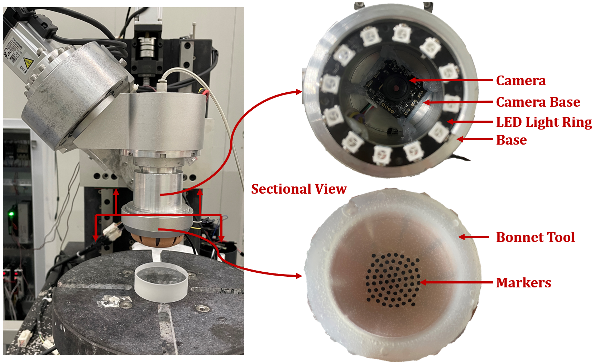
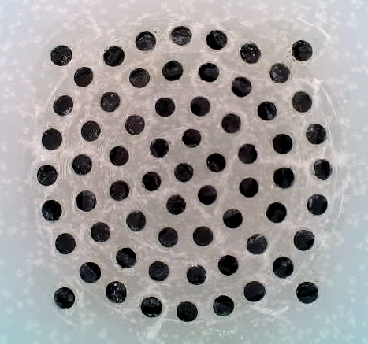
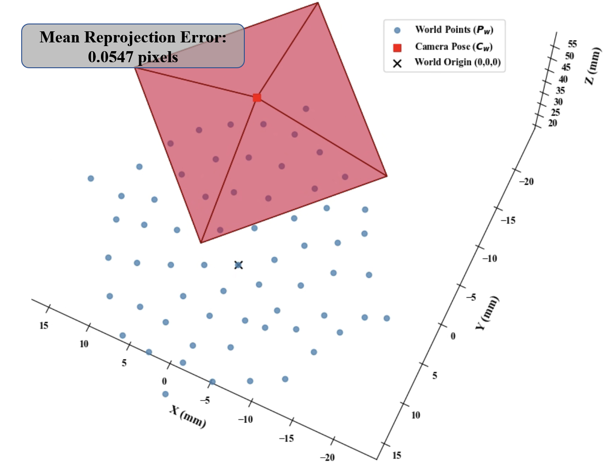
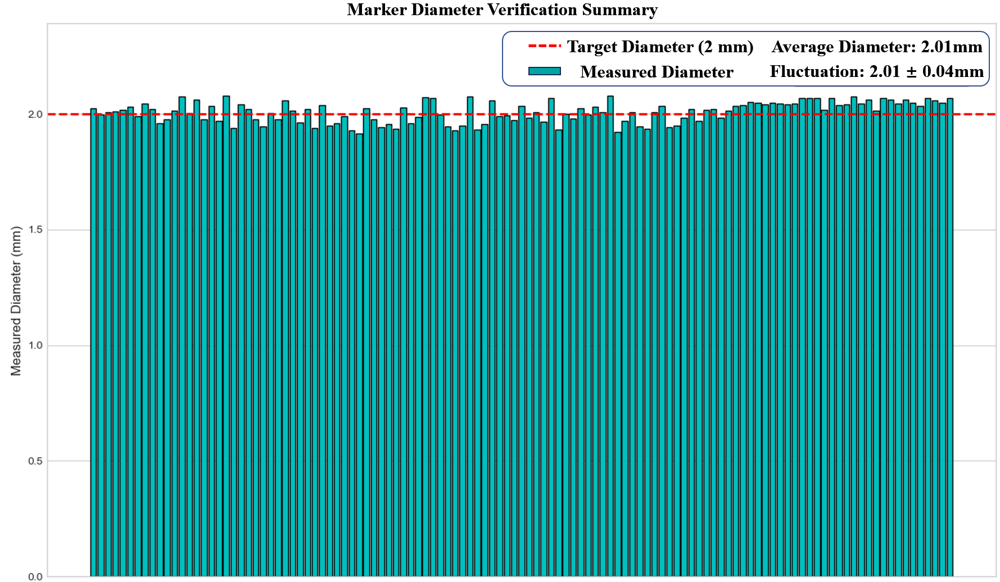
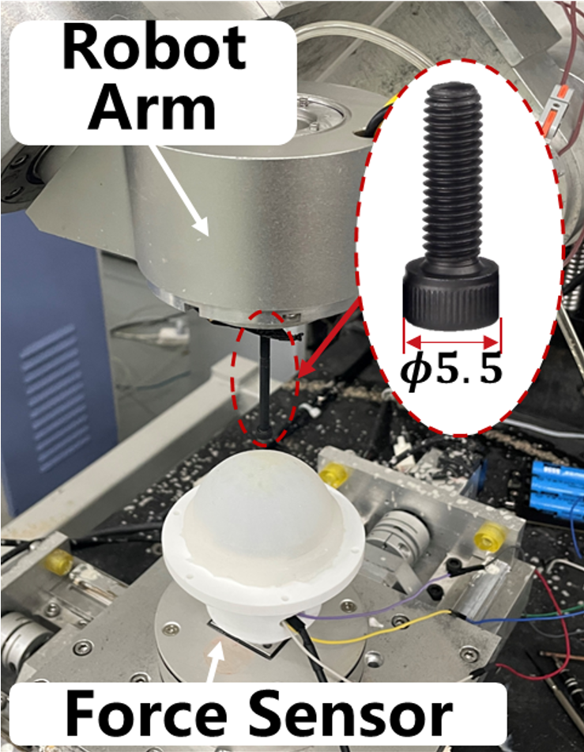
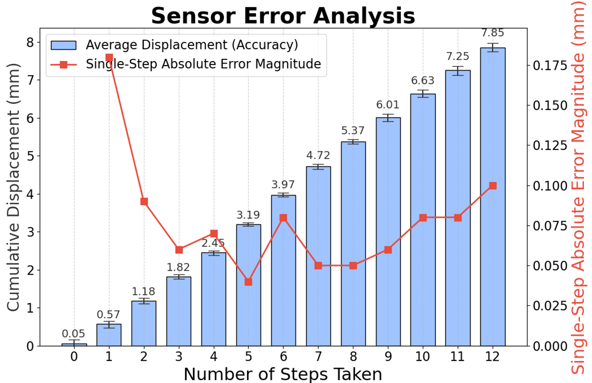

# A Novel Bonnet Polishing Approach with a Vision-Based Sensor for In-Situ Characterization of Contact Force and Pose Misalignment

## Introduction

This work is based on our 2026 paper titled _**A Novel Bonnet Polishing Approach with a Vision-Based Sensor for In-Situ Characterization of Contact Force and Pose Misalignment**_. We propose an embedded vision-based sensor utilizing inner-surface marker tracking to achieve in-situ perception of the contact state. This approach realizes precise pose error compensation and significant surface quality optimization. Supplementary materials are as follows.

## Dependencies

### Requirements
Our algorithm and data processing modules have been tested with the following environment:

*   **Python** (version 3.8+)
*   **OpenCV** (opencv-python, for image processing and marker extraction)
*   **NumPy & SciPy** (for numerical calculation and plane fitting)

Ensure that all dependencies are correctly installed in your environment to run the provided algorithm demos.

## 1. Hardware System Prototype

To validate the in-situ characterization methodology proposed in the paper, a vision-based sensor prototype was developed and integrated into a self-developed 5-axis robot arm. The figure below illustrates the physical implementation details.

## 2. Algorithm Pipeline & Validation

The data processing pipeline transforms raw visual signals into quantitative contact state information through four sequential stages. Below, we detail the implementation and validation results for each stage.

### A. 2D Feature Extraction (Sub-pixel Capture)
The raw image captured by the internal camera is processed to extract marker centroids and IDs. The specific implementation of this algorithm is available in [`marker_extraction.py`](./Algorithm/marker_extraction.py). The figure below compares the **raw captured image** (Left) with the **recognized 2D marker array** (Right), showing the extracted centroids, IDs, and fitted elliptical boundaries.

  <table>
    <tr>
      <td align="center">
        
         
        <b>(a) Raw Captured Image</b>
      </td>
      <td align="center">
        
         
        <b>(b) 2D Recognition</b>
      </td>
    </tr>
  </table>

### B. 3D Displacement Field Reconstruction
Based on the 2D feature changes, the 3D displacement vectors are reconstructed using geometric constraints. The complete reconstruction pipeline is provided in the [`Marker_Calibration`](./Marker_Calibration) directory, which includes:

*   **Intrinsic Matrix Fitting:** [`intrinsic_calibration.py`](./Marker_Calibration/intrinsic_calibration.py) for camera parameter estimation. The mean reprojection error is **0.xx pixels**, as visualized in **Figure (a)** below.
*   **Extrinsic Matrix Fitting:** [`extrinsic_calibration.py`](./Marker_Calibration/extrinsic_calibration.py) for coordinate system alignment. The fitting residual is minimized to **0.xx pixels**, as demonstrated in **Figure (b)** below.
*   **3D Reconstruction:** [`3d_reconstruction.py`](./Marker_Calibration/3d_reconstruction.py) for resolving the spatial displacement field.

  <table>
    <tr>
      <td align="center">
        
         
        <b>(a) Intrinsic Calibration</b>
      </td>
      <td align="center">
        
         
        <b>(b) Extrinsic Calibration</b>
      </td>
    </tr>
  </table>

The figure below visualizes the resulting **3D displacement vector field**, illustrating the marker movement from the initial state (Start) to the deformed state (End).

*(Note: Visualization of the 3D displacement vectors. Blue indicates the initial position, and Red indicates the displaced position.)*

### C. Accuracy Validation
To ensure measurement reliability, we performed the following two-step accuracy validation:

#### 1. Geometric Validation (Marker Diameter)

  <table>
    <tr>
      <td align="center">
        
         
        <b>(a) Markers Photo</b>
      </td>
      <td align="center">
        
         
        <b>(b) Diameter Estimation Accuracy</b>
      </td>
    </tr>
  </table>

#### 2. Mechanical Validation (Probe Indentation)
To validate the algorithmic accuracy, a precision probe indentation test was performed. The tool was pressed in **steps of 0.7 mm (12 steps)**. The comparison between the prescribed probe depth and the algorithm-calculated displacement is shown below.

  <table>
    <tr>
      <td align="center">
        
         
        <b>(a)Experimental Platform</b>
      </td>
      <td align="center">
        
         
        <b>(b) Sensor Error Analysis</b>
      </td>
    </tr>
  </table>

### D. Pose Misalignment Identification
This module implements the "Reference State Comparison" strategy. By analyzing the deviation of the 3D displacement field, a spatial contact plane is fitted to identify the tilt angle.

*(Figure: Visualization of the pose deviation vectors and the final fitted contact plane, indicating the magnitude and direction of the misalignment.)*

## 3. Vision-based Sensor Operation Demos

This section demonstrates the vision-based sensor's response under different contact conditions.

### A. Vertical Compression
In this scenario, the bonnet tool is pressed vertically against the workpiece ($\psi = 0^\circ$).

  <table>
    <tr>
      <th align="center">Physical Setup</th>
      <th align="center">Internal Camera View (Raw)</th>
      <th align="center">Reconstructed Plane</th>
    </tr>
    <tr>
      <td align="center"></td>
      <td align="center"></td>
      <td align="center"></td>
    </tr>
  </table>

### B. Tilted Compression
In this scenario, the tool is pressed against the workpiece surface at a standard polishing precession angle of **15°**. The sensor captures the asymmetric marker displacement characteristic of this pose, which serves as the reference state for subsequent misalignment detection.

  <table>
    <tr>
      <th align="center">Physical Setup</th>
      <th align="center">Internal Camera View (Raw)</th>
      <th align="center">Reconstructed Plane</th>
    </tr>
    <tr>
      <td align="center"></td>
      <td align="center"></td>
      <td align="center"></td>
    </tr>
  </table>

### C. Dynamic Polishing Process
This demo shows the sensor operation during the actual polishing process. The high-speed camera captures stable marker features despite the rotation, validating the robustness of the imaging module.

  <table>
    <tr>
      <th align="center">Polishing Process</th>
      <th align="center">Internal Camera View (Dynamic)</th>
    </tr>
    <tr>
      <td align="center"></td>
      <td align="center"></td>
    </tr>
  </table>

